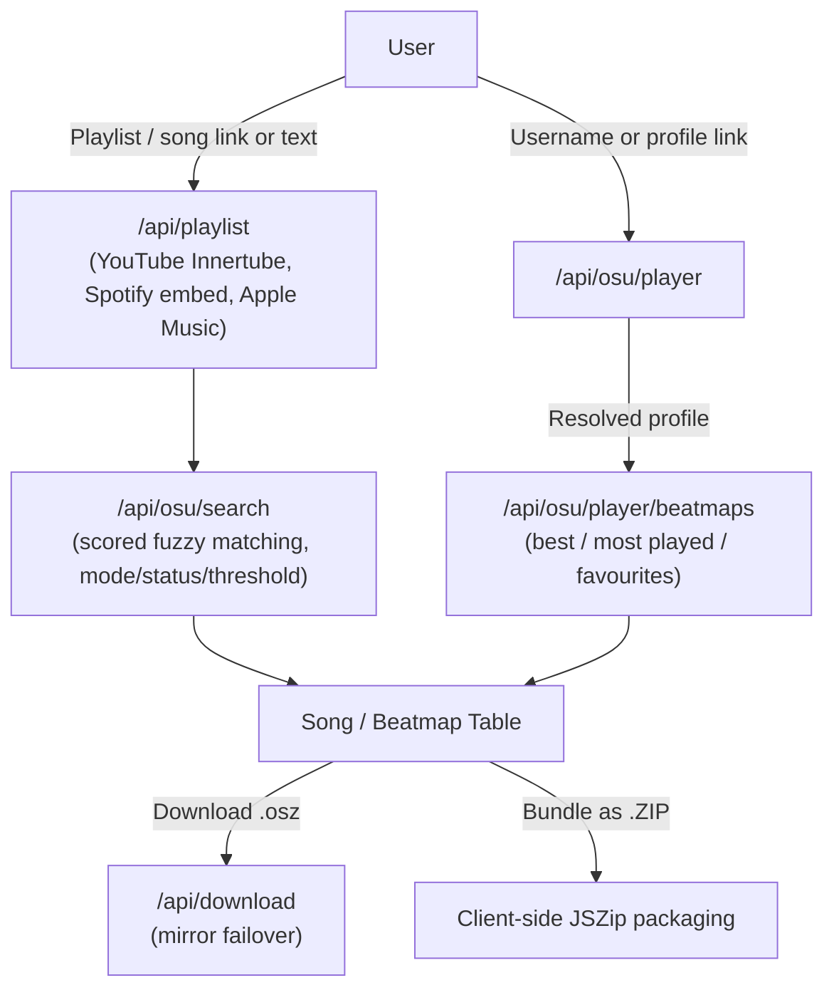

# osu!Sync

Turn playlists, songs, or any osu! player's top plays and favourites into downloadable osu! beatmaps — no manual searching, no API key of your own required.

Point it at a **YouTube / Spotify / Apple Music** playlist, a single song, or an **osu! player's profile**, and it finds the matching beatmapsets and lets you download them one at a time or as a ZIP.

---

## Features

### Three ways in
- **Playlists & tracks** — paste a YouTube playlist/video, Spotify playlist/album/track, or Apple Music playlist/song link. Spotify and Apple Music are read from their public embed/oEmbed metadata, no developer keys needed; YouTube playlists are pulled zero-key via the Innertube API.
- **Plain-text song search** — just type `Artist - Title`.
- **osu! Player Search** — search by username or paste a profile link (`osu.ppy.sh/users/...`). Shows the player's real banner, avatar, rank and pp, then three collapsible sections — **Best Performances**, **Most Played**, and **Favourites** — each paginated locally from a single fetched window, so browsing pages costs no extra API calls.

### Smart matching
- **The artist has to match.** Plenty of different songs share a title, so a beatmap by the wrong artist is never passed off as a match. You get *"Could not find one by Justin Bieber. Closest match:"* above the nearest beatmap, left unticked so it cannot slip into a bulk download. Romanisations, native spellings and alternate names still count as the same artist. [How it works ↓](#how-matching-works)
- **Match Strictness slider** — drag from *Very Loose* to *Very Strict* to control the score cutoff yourself instead of a fixed threshold.
- Filter by game mode (**osu!**, **taiko**, **catch**, **mania**) and status (**Ranked & Loved** or **All**) — applied server-side for playlist search, and to a player's own maps too.
- Manual query editing and an alternative-beatmap picker when the top match isn't the one you want.

### Downloads
- Only **ticked** beatmaps download — nothing downloads by accident, with a select-all per page.
- Single `.osz` download, or bundle everything as a **ZIP** (client-side via JSZip).
- Multi-mirror failover (`catboy.best`, `nerinyan.moe`, `beatconnect.io`, `sayobot`) with a generated fallback if every mirror is down.
- Export as web URLs, `osu://dl/` links, or a plain-text list.
- A draggable, throwable toast confirms each download — grab it, flick it, and it falls with real inertia instead of just fading out.

### Everything else
- Real osu! grade badges (SS/S/A/B/C/D/F, served locally) on player scores, with pp, rank, mods, and play counts shown per entry.
- Live audio previews with a waveform equalizer.
- osu!-lazer-styled checkboxes that gate selection to matched beatmaps only.
- An **Online** panel with live system status and a "What's New" list pulled straight from this repo's latest commits.
- A hit-circle easter egg on the logo (approach circles, judgments, synthesized hit sounds).
- Fully responsive — desktop table / mobile card layouts, and a compact icon-only search bar under 480px.

---

## Quick Start (Local Development)

### 1. Prerequisites
- Node.js 18.x or higher

### 2. Install Dependencies
```bash
npm install
```

### 3. Configure Environment Variables
Copy `.env.example` to `.env.local`:
```bash
cp .env.example .env.local
```

```env
# Required — from osu.ppy.sh -> Account Settings -> OAuth, Client Credentials grant type
OSU_CLIENT_ID=your_osu_client_id
OSU_CLIENT_SECRET=your_osu_client_secret

# Optional — beatmap download mirror priority
DEFAULT_MIRROR=catboy.best
```

YouTube, Spotify, and Apple Music extraction need no API keys or credentials at all.

### 4. Run the Dev Server
```bash
npm run dev
```

Open [http://localhost:3000](http://localhost:3000).

---

## Production Deployment (Vercel)

1. Push this repository to GitHub.
2. Import the project on [Vercel](https://vercel.com).
3. In **Project Settings → Environment Variables**, set `OSU_CLIENT_ID`, `OSU_CLIENT_SECRET`, and optionally `DEFAULT_MIRROR`.
4. In your [osu! OAuth Settings](https://osu.ppy.sh/home/account/edit#oauth), make sure the application uses the **Client Credentials** grant type.

---

## Architecture & Data Flow



All osu! API calls run through a single client-credentials token (`/lib/osu.js`), cached in-memory and refreshed as it nears expiry.

---

## How matching works

### The problem

osu! has more than one song called *Monster*. It has several called *Faded*, *Alone* and
*Sunflower*. A matcher that ranks on title alone will confidently hand you a stranger's song
and call it a match — and because the title matched *perfectly*, no "be stricter" setting can
filter it out. Being stricter only throws away correct results; the wrong one scores at the
very top either way.

So the rule here is simple: **the artist has to match, or you get nothing.**

### What that means in practice

When osu! has your song but under a different artist, you don't get a wrong beatmap and you
don't get a bare "not found" either. You get told which one it is:

| What happened | What you see |
| --- | --- |
| The song is on osu!, by someone else | *Could not find one by Justin Bieber. Closest match:* — followed by the beatmap it did find |
| The artist has no maps on osu! at all | *HUGEL, SOLTO (FR) has no beatmaps on osu!* |
| Nothing matched the title either | *No matching beatmapset found* |

**Flagging isn't hiding.** The nearest beatmap is still shown as a normal row — cover art,
star rating, the alternative-version picker, download, all of it — introduced by a line
saying no map by that artist exists. What the gate changes is that it arrives **unticked**,
so it never joins a bulk ZIP unless you pick it yourself. You get the information and the
choice; what you don't get is a stranger's song quietly presented as a confident match.

The **Match Strictness** slider still works, but it no longer quietly controls whether you get
someone else's song. It trades how many results you see against how sure they are; artist
correctness is not on that dial.

### Deciding whether two artist names are the same person

This is the hard half, because the same artist is written a dozen ways. `ヨルシカ` and
`Yorushika`. `米津玄師` and `Yonezu Kenshi`. `Tuyu` and `Tsuyu`. `Steve Lacy` and
`SteveLacyVEVO`. A cover where osu! credits the singer and the original artist is only in the
tags. All of those have to still count as a match, or being strict just breaks the app.

Rather than guess with string similarity, the matcher asks osu! *what it has by that artist*
and reads the answer off the corpus. Every beatmapset carries both a romanised and a native
artist field, so **osu! is already a dictionary of artist aliases** — `かめりあ` is known to be
`Camellia` because other maps spell it both ways. No hand-written alias table, and it works
for artists nobody thought to list.

Names are checked in order — exact match, a corpus-learned alias, whole-word containment,
romanisation folding (`Tsuyu`/`Tuyu`), artist credited in the tags — and the first one that
fits wins. If none fit, it's a different artist.

### Not all artist names are trustworthy

A Spotify or Apple Music track comes with a real artist field. A YouTube video comes with a
channel name, which might be `Nightcore Gaming`. So how much the artist is trusted depends on
where it came from: **a trusted artist may reject a match, an untrusted one may only confirm
one.** An unverifiable artist is checked against osu! first — `Nightcore Gaming` has 4 maps, so
it isn't a real artist and isn't allowed to vouch for anything. That check is skipped whenever
a result already names the artist exactly, which keeps it to about 0.2 extra API calls per
track.

### Does it actually work?

`bench/` is a benchmark that replays captured osu! API responses through the matcher, so
changes are measured rather than guessed. Verdicts on which candidates are really by the
right artist are human-labelled, because letting the matcher grade its own homework would
measure nothing.

On 37 fixtures chosen to be hard — J-pop romanisations, colliding titles, covers, noisy
YouTube titles, artists absent from osu!, obscure artists whose songs share a title with a
famous one:

| | correct match | **wrong artist** | returned nothing, correctly |
| --- | --- | --- | --- |
| Before | 78.4% | **2.7%** | 16.2% |
| After | **83.8%** | **0%** | 16.2% |

The percentage isn't the point — the *shape* is. Sweeping the strictness slider from loosest
to strictest, the old matcher returns its wrong answer at **every** setting, because that
answer scored at the very top of the range. Being stricter cost correct results and removed
none of the wrong one. The new matcher holds at zero across the whole sweep.

Checked against 50 real tracks from a live Spotify playlist, the old matcher returned 34
beatmaps and the new one returns 33. The one it stopped returning was *"Have you been naughty
or nice? (Game Ver.)" by Flambe!*, offered for Morgan Wallen's *Been By Now*.

> These fixtures deliberately over-represent hard cases, so 83.8% is a number to improve
> against — not an estimate of everyday accuracy. Fixtures are added whenever a real
> mismatch turns up, so the percentage moves as the suite gets harder; only the
> wrong-artist column is meant to stay at zero.

Run it yourself with `npm run bench`; details in [`bench/README.md`](bench/README.md).

---
