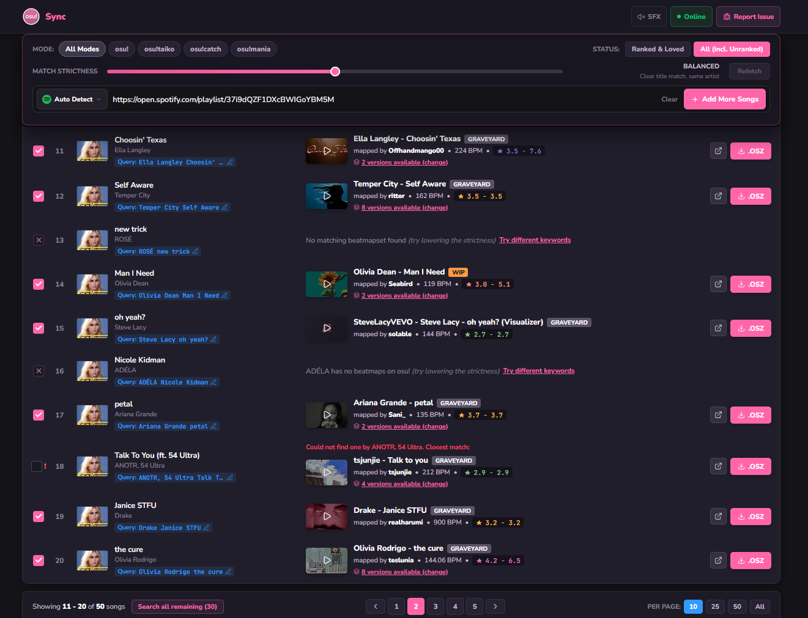
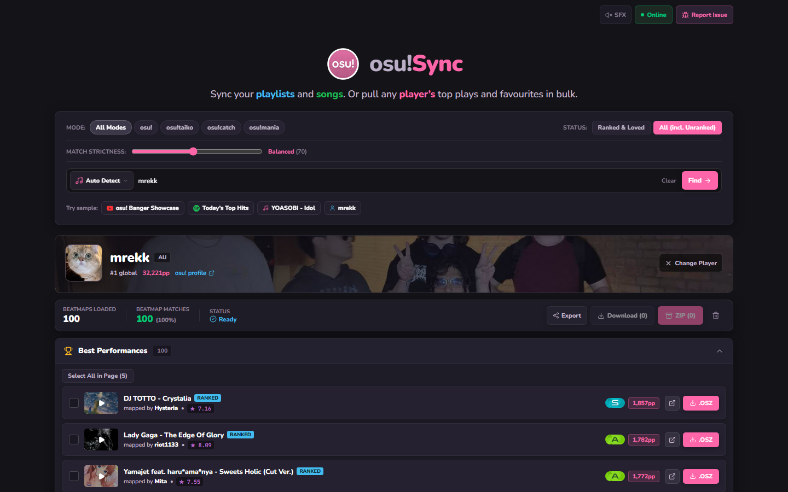
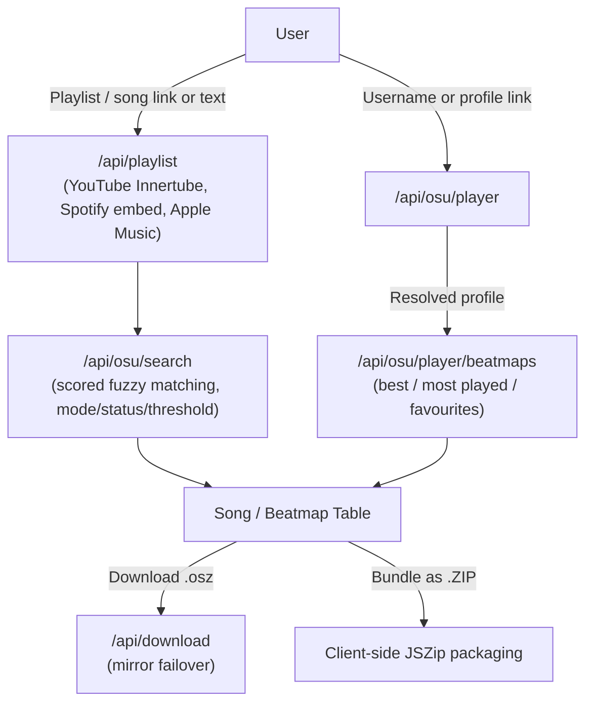

<div align="center">

# [osu!Sync](https://github.com/sidlikesgrapess/osu-playlist-sync)

*Turn playlists, songs, or any osu! player's top plays and favourites into downloadable osu! beatmaps, no manual searching, no API key of your own required*

[](https://osu-playlist-sync.vercel.app/)
[](https://github.com/sidlikesgrapess/osu-playlist-sync/stargazers)

</div>

Point it at a **YouTube / Spotify / Apple Music** playlist, a single song, or an **osu! player's profile**, and it finds the matching beatmapsets and lets you download them one at a time or as a ZIP.

---

## Screenshots

<div align="center">



<sub>A Spotify playlist matched against osu!: every track gets a beatmap, an editable query, or a reason it was refused.</sub>



<sub>Any player's profile, with Best Performances, Most Played and Favourites ready to tick and download.</sub>

</div>

---

## Features

### Three ways in
- **Playlists & tracks** — paste a YouTube playlist/video, Spotify playlist/album/track, or Apple Music playlist/song link. Spotify and Apple Music are read from their public embed/oEmbed metadata, no developer keys needed; YouTube playlists are pulled zero-key via the Innertube API.
- **Plain-text song search** — just type `Artist - Title`.
- **osu! Player Search** — search by username or paste a profile link (`osu.ppy.sh/users/...`). Shows the player's real banner, avatar, rank and pp, then three collapsible sections — **Best Performances**, **Most Played**, and **Favourites** — each paginated locally from a single fetched window, so browsing pages costs no extra API calls.

### Smart matching
- **The artist has to match.** Plenty of different songs share a title, so a beatmap by the wrong artist is never passed off as a match. You get *"Could not find one by Justin Bieber. Closest match:"* above the nearest beatmap, left unticked so it cannot slip into a bulk download. Romanisations, native spellings and alternate names still count as the same artist. [How it works ↓](#how-matching-works)
- **Match Strictness slider** — 0 shows everything osu! returned, 100 shows only exact title-and-artist matches, and the middle is the balanced default. Each position says in words what it will do.
- Filter by game mode (**osu!**, **taiko**, **catch**, **mania**) and status (**Ranked & Loved** or **All**) — applied server-side for playlist search, and to a player's own maps too.
- Manual query editing and an alternative-beatmap picker when the top match isn't the one you want.

### Downloads
- Only **ticked** beatmaps download — nothing downloads by accident, with a select-all per page.
- Single `.osz` download, or bundle everything as a **ZIP** (client-side via JSZip).
- Multi-mirror failover (`catboy.best`, `nerinyan.moe`, `beatconnect.io`, `sayobot`). The browser downloads straight from the first two; the server proxy is a last resort and reports an error rather than handing back a fake file.
- Export as web URLs, `osu://dl/` links, or a plain-text list.
- A draggable, throwable toast confirms each download — grab it, flick it, and it falls with real inertia instead of just fading out.

### Everything else
- Real osu! grade badges (SS/S/A/B/C/D/F, served locally) on player scores, with pp, rank, mods, and play counts shown per entry.
- Live audio previews with a waveform equalizer.
- osu!-lazer-styled checkboxes that gate selection to matched beatmaps only.
- An **Online** panel with live system status and a "What's New" list pulled straight from this repo's latest commits.
- A hit-circle easter egg on the logo (approach circles, judgments, synthesized hit sounds).
- Fully responsive — desktop table / mobile card layouts, and a compact icon-only search bar under 480px.

---

## Quick Start (Local Development)

### 1. Prerequisites
- Node.js 18.x or higher

### 2. Install Dependencies
```bash
npm install
```

### 3. Configure Environment Variables
Copy `.env.example` to `.env.local`:
```bash
cp .env.example .env.local
```

```env
# Required — from osu.ppy.sh -> Account Settings -> OAuth, Client Credentials grant type
OSU_CLIENT_ID=your_osu_client_id
OSU_CLIENT_SECRET=your_osu_client_secret
```

YouTube, Spotify, and Apple Music extraction need no API keys or credentials at all.

### 4. Run the Dev Server
```bash
npm run dev
```

Open [http://localhost:3000](http://localhost:3000).

---

## Architecture & Data Flow



All osu! API calls run through a single client-credentials token (`/lib/osu.js`), cached in-memory and refreshed as it nears expiry.

---

## How matching works

osu! has more than one song called *Monster*. Rank on title alone and you get handed a
stranger's song, and because the title matched perfectly, no "be stricter" setting can
remove it. So the rule is: **the artist has to match, or you get nothing.**

### The pipeline

1. **Clean the title.** `Nightcore`, `Official Video`, `+HDHR` and friends are stripped so
   the search returns something at all.
2. **Search a few ways.** Artist + title, the raw text, the bare title. Everything found
   goes into one pile, and osu!'s own ranking is ignored.
3. **Score every candidate.** Mostly title similarity, with an exact title beating a partial
   one, plus small nudges for ranked and popular maps.
4. **Check the artist.** Exact name, a spelling osu!'s own maps prove is the same person
   (`かめりあ` is `Camellia`), reordered or romanised names, or a credit in the tags.
5. **Refuse a wrong artist outright.** It is a gate, not a penalty: a perfect title can
   never buy back the wrong artist.
6. **But only trust names worth trusting.** Spotify and Apple give a real artist. YouTube
   gives a channel that might be `Nightcore Gaming`, so it is checked against osu! before it
   is allowed to reject anything.
7. **Cut by strictness, then explain.** The slider trades how many results you see against
   how sure they are. If nothing survives, you are told which kind of nothing: wrong artist,
   artist not on osu! at all, or no match.

Rejected maps are still shown, labelled and unticked, so they can never join a bulk ZIP by
accident.

### Does it work?

`bench/` replays captured osu! responses with human-labelled answers, so changes are measured
rather than guessed. On 37 deliberately hard fixtures:

| | correct match | **wrong artist** | correctly returned nothing |
| --- | --- | --- | --- |
| Before | 78.4% | **2.7%** | 16.2% |
| After | **83.8%** | **0%** | 16.2% |

The old matcher returned its wrong answer at *every* strictness setting; the new one stays at
zero across the whole sweep. On 50 real Spotify tracks it returns 33 maps where the old one
returned 34, and the one it dropped was wrong.

> The fixtures over-represent hard cases, so 83.8% is a target to beat, not everyday
> accuracy. Only the wrong-artist column is meant to stay at zero.

Run it with `npm run bench`; details in [`bench/README.md`](bench/README.md).
