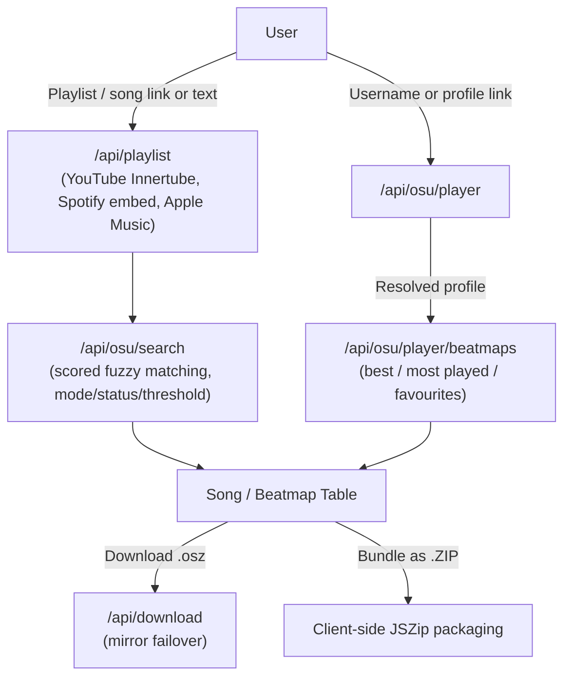

# osu!Sync

Turn playlists, songs, or any osu! player's top plays and favourites into downloadable osu! beatmaps — no manual searching, no API key of your own required.

Point it at a **YouTube / Spotify / Apple Music** playlist, a single song, or an **osu! player's profile**, and it finds the matching beatmapsets and lets you download them one at a time or as a ZIP.

---

## Features

### Three ways in
- **Playlists & tracks** — paste a YouTube playlist/video, Spotify playlist/album/track, or Apple Music playlist/song link. Spotify and Apple Music are read from their public embed/oEmbed metadata, no developer keys needed; YouTube playlists are pulled zero-key via the Innertube API.
- **Plain-text song search** — just type `Artist - Title`.
- **osu! Player Search** — search by username or paste a profile link (`osu.ppy.sh/users/...`). Shows the player's real banner, avatar, rank and pp, then three collapsible sections — **Best Performances**, **Most Played**, and **Favourites** — each paginated locally from a single fetched window, so browsing pages costs no extra API calls.

### Smart matching
- Title/artist scoring (exact match, partial overlap, artist confirmation, ranked/loved bonus) instead of trusting raw search order — every candidate across several query fallbacks gets scored and only the best survive.
- **Match Strictness slider** — drag from *Very Loose* to *Very Strict* to control the score cutoff yourself instead of a fixed threshold.
- Filter by game mode (**osu!**, **taiko**, **catch**, **mania**) and status (**Ranked & Loved** or **All**) — applied server-side for playlist search, and to a player's own maps too.
- Manual query editing and an alternative-beatmap picker when the top match isn't the one you want.

### Downloads
- Only **ticked** beatmaps download — nothing downloads by accident, with a select-all per page.
- Single `.osz` download, or bundle everything as a **ZIP** (client-side via JSZip).
- Multi-mirror failover (`catboy.best`, `nerinyan.moe`, `beatconnect.io`, `sayobot`) with a generated fallback if every mirror is down.
- Export as web URLs, `osu://dl/` links, or a plain-text list.
- A draggable, throwable toast confirms each download — grab it, flick it, and it falls with real inertia instead of just fading out.

### Everything else
- Real osu! grade badges (SS/S/A/B/C/D/F, served locally) on player scores, with pp, rank, mods, and play counts shown per entry.
- Live audio previews with a waveform equalizer.
- osu!-lazer-styled checkboxes that gate selection to matched beatmaps only.
- An **Online** panel with live system status and a "What's New" list pulled straight from this repo's latest commits.
- A hit-circle easter egg on the logo (approach circles, judgments, synthesized hit sounds).
- Fully responsive — desktop table / mobile card layouts, and a compact icon-only search bar under 480px.

---

## Quick Start (Local Development)

### 1. Prerequisites
- Node.js 18.x or higher

### 2. Install Dependencies
```bash
npm install
```

### 3. Configure Environment Variables
Copy `.env.example` to `.env.local`:
```bash
cp .env.example .env.local
```

```env
# Required — from osu.ppy.sh -> Account Settings -> OAuth, Client Credentials grant type
OSU_CLIENT_ID=your_osu_client_id
OSU_CLIENT_SECRET=your_osu_client_secret

# Optional — beatmap download mirror priority
DEFAULT_MIRROR=catboy.best
```

YouTube, Spotify, and Apple Music extraction need no API keys or credentials at all.

### 4. Run the Dev Server
```bash
npm run dev
```

Open [http://localhost:3000](http://localhost:3000).

---

## Production Deployment (Vercel)

1. Push this repository to GitHub.
2. Import the project on [Vercel](https://vercel.com).
3. In **Project Settings → Environment Variables**, set `OSU_CLIENT_ID`, `OSU_CLIENT_SECRET`, and optionally `DEFAULT_MIRROR`.
4. In your [osu! OAuth Settings](https://osu.ppy.sh/home/account/edit#oauth), make sure the application uses the **Client Credentials** grant type.

---

## Architecture & Data Flow



All osu! API calls run through a single client-credentials token (`/lib/osu.js`), cached in-memory and refreshed as it nears expiry.

---
