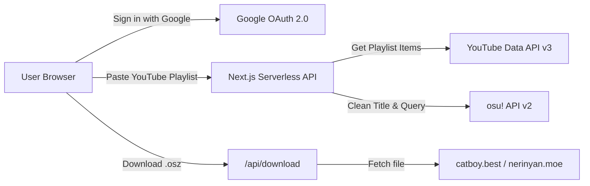

# osu! Playlist Sync

> A Next.js web application to sync YouTube & YouTube Music playlists directly to **osu! beatmaps** with automatic title cleaning, official osu! API search, and one-click `.osz` / ZIP downloads via community mirrors.

---

## Features

- **Intelligent Title Cleaner**:
  - Automatically cleans noisy YouTube video titles (`[MV]`, `(Official Audio)`, `[HQ]`, `【...】`, `(4K 60FPS)`) into precise `Artist - Title` queries.
- **Accurate osu! API v2 Matching**:
  - Fetches ranked, loved, and approved beatmaps with cover art, creator info, BPM, and star difficulty ratings.
  - Interactive **Alternative Beatmap Picker** to pick different mapset versions.
- **Live Audio Previews**:
  - In-browser MP3 preview player with dynamic visualizer animation.
- **Fast Batch Downloads**:
  - Single `.osz` download per beatmap.
  - Instant **"Bundle as .ZIP"** with client-side packaging (`JSZip`) and celebratory confetti (`canvas-confetti`).
  - Powered by high-speed community mirrors (`catboy.best`, `nerinyan.moe`, `beatconnect.io`) with automatic failover.
- **Vercel Serverless Ready**:
  - Deploys instantly to Vercel with zero server maintenance.

---

## Quick Start (Local Development)

### 1. Prerequisites
- Node.js 18+ installed

### 2. Clone & Install Dependencies
```bash
npm install
```

### 3. Configure Environment Variables
Copy `.env.example` to `.env.local`:
```bash
cp .env.example .env.local
```

Fill in your OAuth credentials (optional for initial demo mode testing):
```env
GOOGLE_CLIENT_ID=...
GOOGLE_CLIENT_SECRET=...

OSU_CLIENT_ID=...
OSU_CLIENT_SECRET=...

NEXTAUTH_SECRET=your_random_secret_string
NEXTAUTH_URL=http://localhost:3000
```

### 4. Run Development Server
```bash
npm run dev
```

Open [http://localhost:3000](http://localhost:3000) in your browser.

---

## Production Deployment (Vercel)

1. Push this repository to GitHub.
2. Import the repo on [Vercel](https://vercel.com).
3. In **Project Settings → Environment Variables**, add:
   - `GOOGLE_CLIENT_ID`
   - `GOOGLE_CLIENT_SECRET`
   - `OSU_CLIENT_ID`
   - `OSU_CLIENT_SECRET`
   - `NEXTAUTH_SECRET` (generate with `openssl rand -base64 32`)
   - `NEXTAUTH_URL` (set to your Vercel domain, e.g. `https://osu-playlist.vercel.app`)
4. In [Google Cloud Console](https://console.cloud.google.com/apis/credentials):
   - Set Authorized Redirect URI to: `https://your-domain.vercel.app/api/auth/callback/google`
5. In [osu! Account Settings](https://osu.ppy.sh/home/account/edit#oauth):
   - Ensure your OAuth application is created and client credentials match.

---

## Architecture & Data Flow



---

