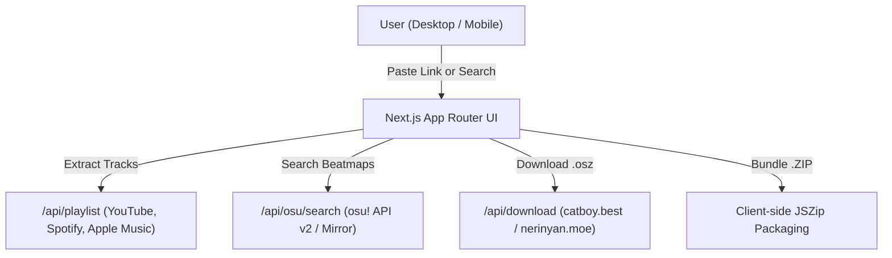

# osu! Playlist Sync

A modern Next.js web application to sync music playlists and individual songs from **YouTube**, **Spotify**, and **Apple Music** directly to **osu! beatmaps** with intelligent metadata extraction, title cleaning, official osu! API search, and one-click `.osz` / ZIP downloads via community mirrors.

---

## Features

- **Multi-Platform Playlist & Song Extraction**:
  - Auto-detects and extracts tracks from **YouTube** playlists and videos, **Spotify** playlists, albums, and tracks (via public metadata and embed extractors), **Apple Music** playlists and songs, as well as direct text searches (e.g. `YOASOBI - Idol`).
- **Intelligent Title Cleaner**:
  - Automatically cleans noisy video and audio titles (`[MV]`, `(Official Audio)`, `[HQ]`, `【...】`, `(4K 60FPS)`) into precise `Artist - Title` search terms.
- **Accurate osu! Search & Filter Modes**:
  - Search and filter across all 4 game modes (**osu!**, **osu!taiko**, **osu!catch**, **osu!mania**) and map statuses (**Ranked & Loved**, **All / Unranked**).
  - Shows cover art, creator info, BPM, and difficulty star ratings.
  - Interactive **Alternative Beatmap Picker** to select different mapset versions or difficulties.
- **osu! lazer Styled Checkboxes & Gating**:
  - Custom osu! lazer style checkboxes.
  - Automatically prevents selecting tracks that do not have a beatmap match.
- **Pagination & Query Optimization**:
  - Fast paginated table with selectable page sizes (10, 25, 50, All) and on-demand search to minimize query overhead.
- **Live Audio Previews**:
  - In-browser MP3 preview player with real-time waveform equalizer visualizer.
- **Fast Batch & Single Downloads**:
  - Direct single `.osz` download per beatmap.
  - Instant **Bundle as .ZIP** with client-side packaging (`JSZip`) and celebratory confetti.
  - Multi-mirror failover support (`catboy.best`, `nerinyan.moe`, `beatconnect.io`).
  - Formatted exports for **Web URLs**, **osu! Direct (`osu://dl`)**, and plain text song lists.
- **osu! Hit Circle Easter Egg**:
  - Interactive logo click easter egg featuring approach circle rings, hit flash, combo counter, Web Audio synthesized hit sounds, and `100` / `300` / `FC!` judgments.
- **Mobile & Tablet Optimized**:
  - Fully responsive layout switching between desktop tables and touch-friendly mobile frosted glass cards.

---

## Quick Start (Local Development)

### 1. Prerequisites
- Node.js 18.x or higher installed

### 2. Install Dependencies
```bash
npm install
```

### 3. Configure Environment Variables
Copy `.env.example` to `.env.local`:
```bash
cp .env.example .env.local
```

Configure your credentials in `.env.local`:
```env
OSU_CLIENT_ID=your_osu_oauth_client_id
OSU_CLIENT_SECRET=your_osu_oauth_client_secret

# Optional: For server-side YouTube Data API v3 playlist fetching
YOUTUBE_API_KEY=your_youtube_api_key
```

### 4. Run Development Server
```bash
npm run dev
```

Open [http://localhost:3000](http://localhost:3000) in your browser.

---

## Production Deployment (Vercel)

1. Push this repository to GitHub.
2. Import the project on [Vercel](https://vercel.com).
3. In **Project Settings -> Environment Variables**, configure:
   - `OSU_CLIENT_ID`
   - `OSU_CLIENT_SECRET`
   - `YOUTUBE_API_KEY` (optional)
4. In your [osu! OAuth Settings](https://osu.ppy.sh/home/account/edit#oauth), ensure your application is created with Client Credentials grant type.

---

## Architecture & Data Flow



---

## License

MIT License. Developed for the osu! and rhythm game community.
